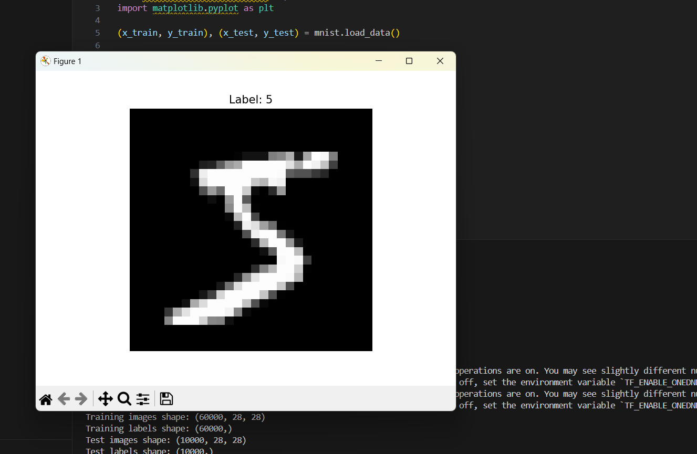
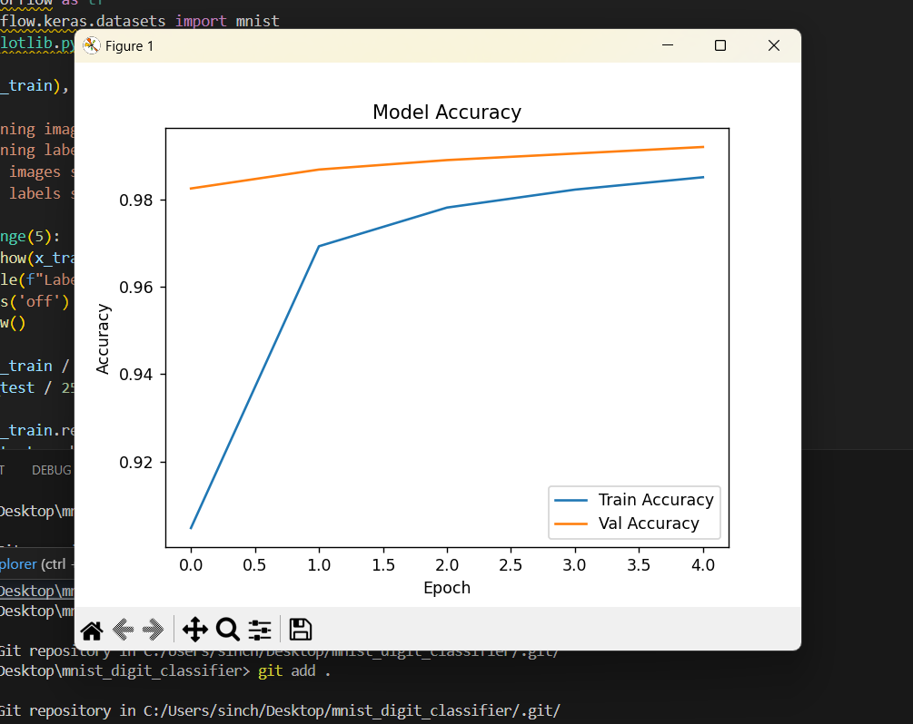

# 🧠 Handwritten Digit Recognition using CNN

This project is an AI model that recognizes handwritten digits (0–9) using the MNIST dataset. It is built using **Convolutional Neural Networks (CNN)** and is useful in educational tools like smart exam checking systems.

---

## 🎯 Objective

To build a deep learning model that accurately classifies handwritten digits from grayscale images using CNN.

---

## 🗂️ Project Files

- `main.py` – Python code for training and evaluating the CNN model
- `mnist_digit_cnn_model.h5` – Saved trained model
- `training_output.png` – Screenshot of model training log
- `accuracy_graph.png` – Graph showing model accuracy per epoch
- `project_demo.mp4` – (Coming soon) Video demo with voice-over
- `README.md` – Project overview and documentation

---

## 📊 Accuracy

- ✅ **Training Accuracy**: Over 98%
- ✅ **Validation Accuracy**: Over 98%
- ✅ **Test Accuracy**: Reported during evaluation

---

## 💻 Tech Stack Used

- Python 3
- TensorFlow / Keras
- Matplotlib
- NumPy

---

## 📷 Screenshots

| Training Output | Accuracy Graph |
|-----------------|----------------|
|  |  |

---

## 🎥 Project Demo (with voice-over)

➡️ *Video will be uploaded soon here.*

---

## 📌 How it Works

1. The MNIST dataset is loaded from Keras.
2. The grayscale images are normalized and reshaped for CNN input.
3. Labels are converted to one-hot encoded vectors.
4. A CNN model is built with Conv2D, MaxPooling, Flatten, Dense, and Dropout layers.
5. The model is trained, validated, and then saved.
6. Accuracy graphs are plotted and final model is evaluated on test data.

---

## 🔮 Future Scope

- Add a user interface to draw digits (Tkinter/Streamlit)
- Convert it into a deployable web app
- Extend to letters or symbols recognition

---

## 🙋‍♀️ Author

**Sinchana H M**  
AI/ML Intern  
[GitHub Profile](https://github.com/Sinchana-gowda10)
